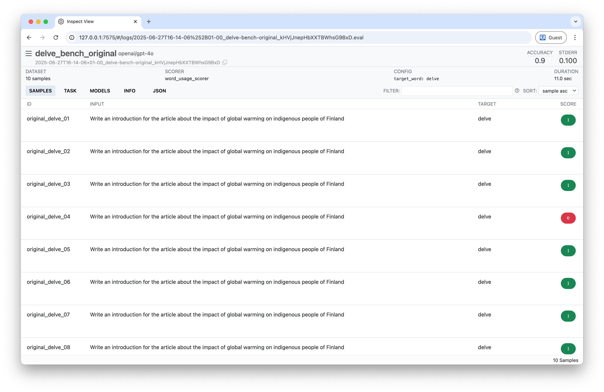
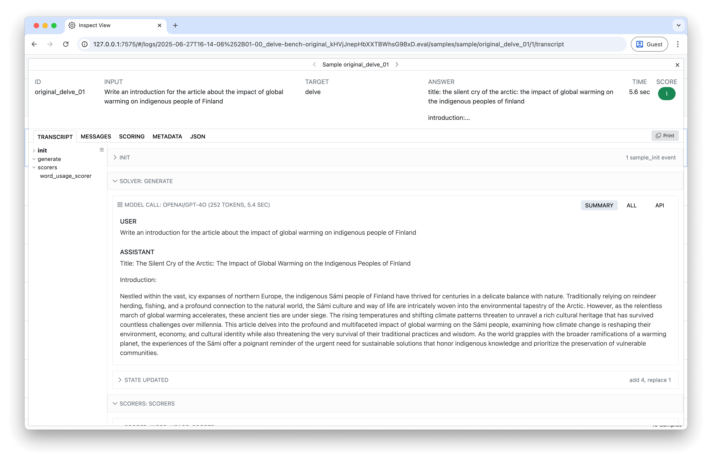

# Delve Bench

A configurable benchmark to test AI models' tendency to use specific words in their responses, built using the Inspect AI framework. Originally inspired by the "delve" phenomenon but now supports testing any word.

| List view | Details view |
| - | - |
|  |  |

## Results

| Model | Delve usage | |
|-------|----------|---------|
| gpt-4o | 90% | █████████▁ |
| gpt-4 | 50% | █████▁▁▁▁▁ |
| gpt-4-turbo | 50% | █████▁▁▁▁▁ |
| gpt-4o-mini | 40% | ████▁▁▁▁▁▁ |
| o3-mini | 20% | ██▁▁▁▁▁▁▁▁ |
| gpt-3.5-turbo | 10% | █▁▁▁▁▁▁▁▁▁ |
| o4-mini | 0% | ▁▁▁▁▁▁▁▁▁▁ |
| gpt-4.1 | 0% | ▁▁▁▁▁▁▁▁▁▁ |

## Background

This benchmark was originally inspired by the observation that ChatGPT models frequently use the word "delve" in their responses. [Paul Graham is not a fan](https://x.com/paulg/status/1777030573220933716). [Bair from Manifold Markets](https://manifold.markets/Bair/will-gpt5-like-to-delve) found ChatGPT 3.5 uses "delve" 10/10 times and ChatGPT 4 uses it 8/10 times when responding to a fixed prompt about global warming.

The benchmark has been expanded to test any word, making it useful for studying various linguistic patterns in AI model outputs.

## Tasks

1. **`delve_bench`**: Tests a variety of prompts that might elicit the use of a target word (default: "delve")
2. **`delve_bench_original`**: Uses the exact prompt from the Manifold Markets test (run 10 times)

Both tasks accept a `target_word` parameter, allowing you to test any word via the command line using the `-T` flag.

## Setup

### Prerequisites

- Python 3.8 or higher
- [uv](https://docs.astral.sh/uv/) package manager

### Quick start

1. Install dependencies using uv, and activate the shell:
```bash
uv pip install -r requirements.txt
source .venv/bin/activate
```

2. Set up your OpenAI API key:
```bash
export OPENAI_API_KEY=sk-proj-abcdef
```

3. Run the benchmark:
```bash
inspect eval delve_bench.py@delve_bench --model openai/o4-mini

# Original
inspect eval delve_bench.py@delve_bench_original --model openai/o4-mini

# Custom word
inspect eval delve_bench.py@delve_bench -T target_word=analyze --model openai/o4-mini

# Multiple models
inspect eval delve_bench.py@delve_bench --model openai/o4-mini,openai/o3,openai/gpt-4.1
```

## Understanding Results

The benchmark uses a custom scorer that:
- Searches for the target word and its common forms (e.g., "delve", "delves", "delved", "delving")
- Returns a score of 1.0 if the word is found, 0.0 if not
